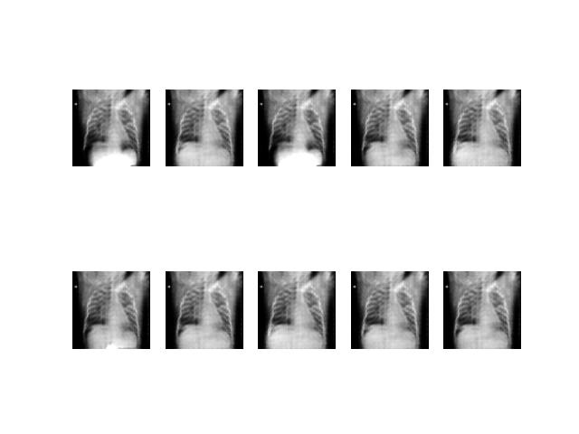
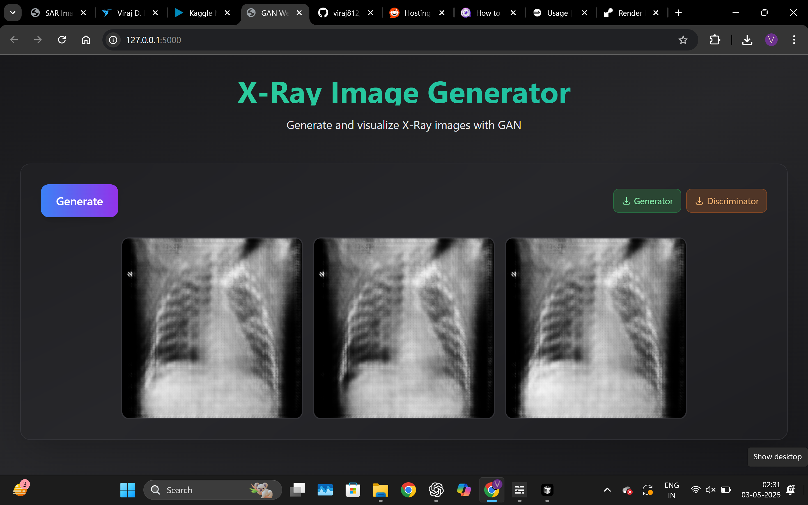

# Xray Image Augmentation using Generative Adverserial Network (GAN)

## Link to get the trained generator and discriminator model :-
### Generator: [Generator Drive Link](https://drive.google.com/file/d/1DYsu2rG82CeDEjjYUISH-mALTTmGio0Z/view?usp=drive_link)
### Discriminator: [Discriminator Drive Link](https://drive.google.com/file/d/1pr_WOsB-imbtNdwqrhndeym_aXp3MGiC/view?usp=drive_link)

## The generated xray images model is shown below:

## The xray generator website is shown below:

